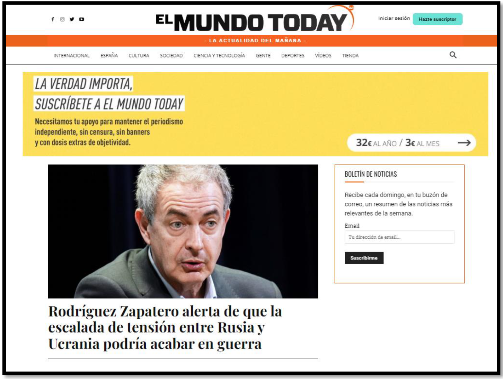
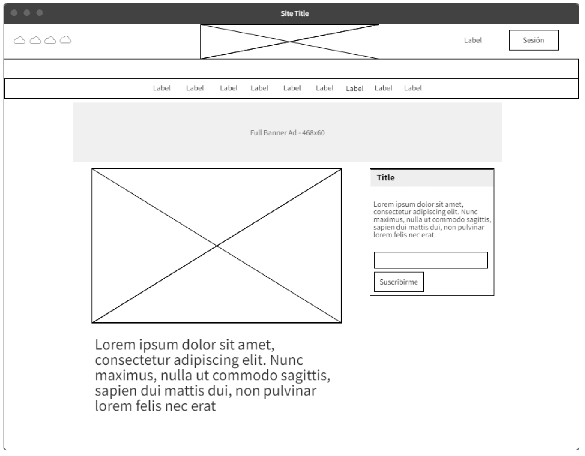

---
title: UD1 - Fonaments d'Interfícies - Activitats Pràctiques
titlepage: true
subtitle: Xuso Ortí Monton - Josep Magraner Ramon
lang: es
toc-own-page: true
toc-title: Continguts
titlepage-rule-height: 0
titlepage-text-color: "7421D6"
titlepage-background: "./img/portades2024DAW.png"
page-background: "./img/bkaztar.png"
header-left: \includegraphics{./img/logocap.png} 2daw i 2daw_semi
header-right: Curs 2023-2024
footer-left: IES Jaume II el Just - Disseny d'interfícies web 
footer-right: \thepage/\pageref{LastPage}
header-includes:
    - \usepackage{graphicx}
    - \usepackage{lastpage}
    - \usepackage{xltxtra}
    - \usepackage{listings}
    - \usepackage{pdflscape}
    - \usepackage{caption}
...

# 1. Colors i planificació de la web.

## 1.1 Colorimetria

Investiga que és la **colorimetria** i intenta averiguar per a que serveixes els següents instruments:
- Colorímetre
- Densitòmetre
- Espectròmetre
- Espectradiòmetre

## 1.2 Combinacions de colors

Busca tres exemples de logos o interfícies (el que preferisques) amb combinacions de colors complementaris, anàlegs o monocromàtics.

## 1.3 Mapa web

Intenta realitzar el mapa del lloc, de qualsevol portal web que vulgues (pot ser imaginari). Descriu-lo i detalla com seria (o és) el arbre del lloc.

Defineix entre 6 i 12 pàgines al lloc web.
Com a exemple, pots basar-te en la [Web de la UPV](https://www.upv.es/entidades/vpt/mapa-del-sitio/). Ells tenen un mapa Web fet com un arbre jeràrquic:

Que, com podreu comprovar, representa les pàgines del lloc i la seua jerarquia.

# 2. Interfície web

## 2.1 Anàlisi

Escull una de les següents dues pàgines per a realitzar aquesta tasca.

https://smartcity.valencia.es/noticias/
https://www.ionos.es/

Hauràs de realitzar el següent:

Identifica l’estructura de la pàgina. En concret, deuràs indicar on es situen les següents seccions: Capçalera, Cos, Peu.

Una vegada localitzades les seccions, identifica (mínim 1 de cada):

- Elements de navegació.
- Elements d’identificació.
- Elements d’interacció.
- Elements de contingut.

Per a cada element/secció, fes una captura de pantalla i adjunta-ho tot, junt una breu descripció que la identifique, a un document en **format PDF**.

## 2.2 Wireframe

A continuació, escull una pàgina Web que t’agrade i que cregues que està ben estructurada, i dissenya un WIREFRAME a partir d'alguna de les pàgines que continga. Compte, sols d’una, no de tot el portal. Si no
trobes la inspiració en aquest moment, pots fer-lo dels portals webs indicats dalt.

Ho farem amb l’eina MockFlow. Hi ha d’altres, com Balsamiq Mockups que, si ho preferixes, també pots utilitzar.
Exemple:

# 3. Mockup

## 3.1 Creació de Mockup

Juga amb alguna de les eines que s'han proposat a classe i realitza un `mockup` senzill de lliure creació.

> Entrega un document **PDF** amb la teua sol·lució de la pràctica.

