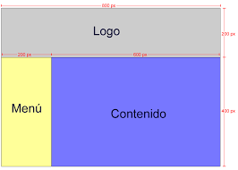
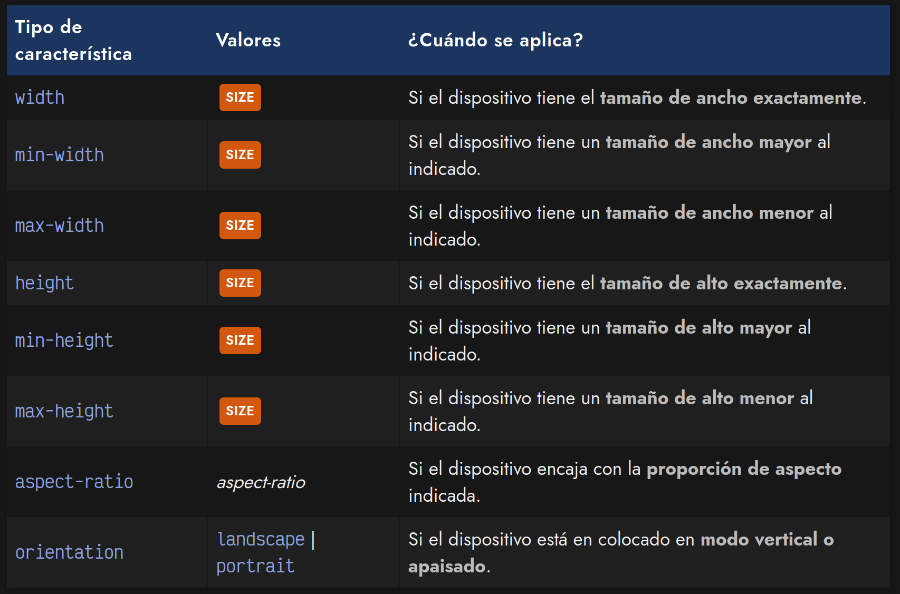
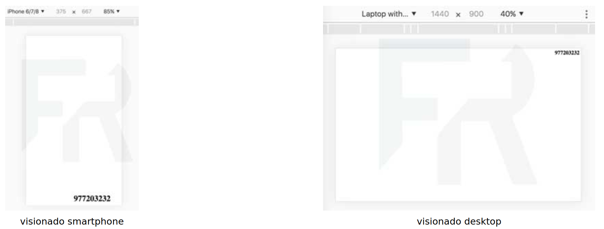
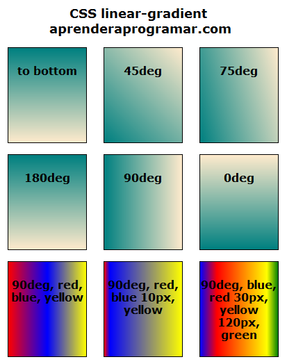

## Tipus de disseny 

En el disseny web podem identificar tres tipus de disseny que obeeixen bàsicament a l’evolució històrica de la web paral·lelament a les diferents millores tecnològiques que s’han produït. Si bé, en un primer moment la visualització de pàgines web es produïa en entorns molt controlats, és a dir, en monitors d’unes dimensions poc variables, en l’actualitat una mateixa pàgina web pot ser visualitzada en dispositius diferents amb pantalles amb dimensions diferents. És per això que a l’hora de fer un disseny web hem de tindre en compte quin seran els dispositius i dimensions més usuals per a visualitzar el nostre lloc web.


### Maquetació fixa 

El disseny fixe o fixed web és el més utilitzat fins la data, i és aquell que és inalterable amb independència del dispositiu de visualització i te les següents característiques.

1.  **Ample Fixe:** La característica principal és que té un ample de
    pàgina fixe i , per tant, la mida de la pàgina web no canvia quan
    l'usuari redimensiona la finestra del navegador o utilitza
    diferents dispositius. L\'ample es manté constant i no s\'ajusta
    automàticament a la pantalla de l\'usuari.

2.  **Mides Absolutes:** En una maquetació fixa, les dimensions dels
    elements, com ara imatges, caixes de text i elements de la pàgina,
    es defineixen utilitzant unitats absolutes com píxels (px) en lloc
    d\'unitats relatives com percentatges (%) o ems (em). La mida dels
    elements no varia quan l\'ample de la pantalla canvia.

3.  **Disseny Consistent:** La disposició i el disseny de la pàgina web
    són constants i consistents en diferents resolucions i dispositius.

4.  **Optimització per una Resolució:** Aquest tipus de disseny està
    optimitzat per a una resolució o amplada de pantalla específica.
    Això pot ser adequat per a determinades aplicacions o quan es vol
    assegurar un aspecte específic de la pàgina.

5.  **Limitacions en Dispositius Mòbils:** La maquetació fixa no
    s\'adapta bé als dispositius mòbils, ja que pot resultar en una
    experiència de l\'usuari deficient. Els usuaris han d'utilitzar
    l'eina de zoom per veure i llegir el contingut.

6.  **Facilitat de Desenvolupament:** Aquest tipus de disseny és més
    senzill de desenvolupar, ja que no requereix les adaptacions
    d'altres tipus de disseny.



### Disseny Fluid 

El disseny web fluid, es caracteritza per adaptar-se a l'amplada de la finestra del navegador o de la pantalla de l'usuari. Aquest tipus de disseny és menys utilitzat que el disseny fixe, ja que requereix de molt més treball per part del dissenyador, donat que, si no es realitza
correctament, pot resultar poc atractiu. El disseny fluid ofereix les següents característiques i elements específics:

- **Amplada Variable**: En un disseny fluid, l'ample del lloc web s'ajusta automàticament a l'amplada de la finestra del navegador. Això significa que el contingut es redistribueix i es redimensiona per ocupar l'espai disponible.

- **Unitats Relatives**: En lloc d'utilitzar unitats absolutes com píxels (px), el disseny fluid utilitza les unitats relatives com ara percentatges (%) o ems (em). Això permet als elements adaptar-se a l'ample de la finestra. 

- **Disposició Flexible**: Els elements i els blocs de contingut es redimensionen i canvien de lloc a mesura que l'ample de la finestra canvia. Això significa que el disseny fluid pot ser més adaptable que una maquetació fixa, però menys adaptable que un disseny responsive.

- **Scroll Vertical**: En un disseny fluid, quan el contingut supera l'ample de la finestra del navegador, es pot requerir un desplaçament vertical (scroll) per veure la part oculta. A diferència d'un disseny fix, no es produeix un desplaçament horitzontal.

- **Utilització de màxims i mínims**: Per a evitar comportaments no desitjats que tinguen com a conseqüència una visualització poc atractiva, aquest tipus de disseny sol utilitzar les propietats `min-height, min-width, max-width i max-height`.
   


    

## Disseny Responsive 

Un disseny web responsive o sensible és disseny que es caracteritza per adaptar-se a diferents resolucions i dimensions de pantalla, adaptant-se d’una manera òptima als usuaris en tot tipus de. Amb el disseny responsive s’assegurem que la informació mostrada siga la mateixa per a totes les vistes però amb canvis el disseny final pot variar sensiblement. La utilització d’este tipus de disseny va cada vegada en augment. A continuació, es detallen les característiques i els elements claus del disseny web responsive:

- **Flexibilitat d'Amplada**: El disseny responsive utilitza unitats relatives com percentatges (%) en lloc d'unitats absolutes com píxels (px) per definir les mides dels elements i dels continguts. 
  
- **Punts de ruptura (Breakpoints)**: En un disseny responsive, s'utilitzen punts de ruptura (breakpoints) que determinen quan i com es reorganitza o es redimensiona el contingut per a les diferents resolucions. Aquests punts de trencament s'ajusten a les dimensions més comunes de les pantalles dels dispositius, com ara telèfons mòbils, tauletes i ordinadors.
  
- **Reorganització del Contingut**: El disseny responsive pot reorganitzar els elements, canviar la disposició i, fins i tot, ocultar o mostrar contingut específic per proporcionar una experiència òptima. Això implica ajustar la grandària del text, modificar la disposició de les columnes i les imatges, entre altres canvis.
  
- **Imatges Adaptables**: El disseny responsive inclou l'ús de tecniques com ara imatges flexibles (utilitzant l'atribut `srcset`) i imatges amb dimensions relatives (utilitzant unitats com vw i vh) per assegurar que les imatges s'adapten correctament.
  
- **Aplicació d’estils CSS mitjançant Media Queries**: Les media queries són utilitzades en els fulls d'estil (CSS) per aplicar estils específics a diferents punts de ruptura o resolucions de pantalla. Això permet ajustar fonts, mides de text, marges, colors i altres propietats d'estil per a cada resolució.
  
- **Accessibilitat**: Un bon disseny responsive té en compte la semàntica d’HTML i l'accessibilitat, assegurant-se que el contingut sigui fàcilment llegible i accessible en tots els dispositius.


- **Flexibilitat d\'Amplada**: El disseny responsive utilitza unitats relatives com percentatges (%) en lloc d'unitats absolutes com píxels (px) per definir les mides dels elements i dels continguts.

**Punts de ruptura (Breakpoints)**: En un disseny responsive, s'utilitzen punts de ruptura (breakpoints) que determinen quan i com es reorganitza o es redimensiona el contingut per a les diferents resolucions. Aquests punts de trencament s'ajusten a les dimensions més comunes de les pantalles dels dispositius, com ara telèfons mòbils, tauletes i ordinadors.

**Reorganització del Contingut**: El disseny responsive pot reorganitzar els elements, canviar la disposició i, fins i tot, ocultar o mostrar contingut específic per proporcionar una experiència òptima. Això implica ajustar la grandària del text, modificar la disposició de les columnes i les imatges, entre altres canvis.

**Imatges Adaptables**: El disseny responsive inclou l'ús de tècniques com ara imatges flexibles (utilitzant l'atribut \`srcset\`) i imatges amb dimensions relatives (utilitzant unitats com vw i vh) per assegurar que les imatges s'adapten correctament.

**Aplicació d'estils CSS mitjançant Media Queries**: Les media queries són utilitzades en els fulls d'estil (CSS) per aplicar estils específics a diferents punts de ruptura o resolucions de pantalla. Això permet ajustar fonts, mides de text, marges, colorsi altres propietats d'estil per a cada resolució.

**Accessibilitat**: Un bon disseny responsive té en compte la semàntica d'HTML i l'accessibilitat, assegurant-se que el contingut sigui fàcilment llegible i accessible en tots els dispositius.

## Media Queries


  
### Concepte

CSS3 introdueix un el mecanisme anomenat Media Queries el qual permet aplicar estils en funció del tipus de mitjà en el que es mostren els documents. A través del selector `@media` i aplicant distintes condicions com l'ample del medi, el suport per a colors, etc., es poden variar els
estils que s'utilitzen en el document.

### Tipus de medis 


### Condicions 

Existeix un conjunt extens de propietats a les que podem aplicar o no determinats estils. Cal tenir en compte que quan ens referim a dispositiu d'eixida, indiquem un monitor d'ordinador, televisió, etcètera, mentre que quan ens referim a pantalla ens referim a alguna cosa com una finestra de navegador, que òbviament te una mida variable.

!!! warning "Condicions"

    Existeixen moltes més condicions per a les `media quary`, investiga altres que no apareixen en la següent taula.




### Operadors Lògics 

Les Media Query permeten l'ús d'expressions semblant a les dels llenguatges de programació per a crear expressions condicionals complexes, i en conseqüència, si compleix una condició, o un conjunt d'elles, s'apliquen les regles d'estil.

- **Operador AND**

Aquest operador és útil quan necessitem aplicar un estil si totes les
condicions són certes.

```css
@media (min-width:1024px) and (orientation: landscape) {}
```

- **Operador OR**

En aquest cas no existeix un operador explícit. La manera d'aplicar a un medi o a un altre un estil utilitzarem l'enumeració de selectors separats per comes, com ja ho fem amb l'aplicació d'estils convencional.

```css
@media (max-width:800px) handled and (orientation: portrait){}
```

- **Operador NOT**

Si volem aplicar un estil a aquells medis que no complisquen alguna propietat especifica, utilitzarem l'operador not.

```css
@media not screen and(color){}
```

### Exemple simple

!!! note "Exemple de media query"

    - Azul para resoluciones menores a 400 píxeles de ancho (móviles).
    - Rojo para resoluciones entre 400 píxeles y 800 píxeles de ancho (tablets).
    - Verde para resoluciones mayores a 800 píxeles (desktop).


```css
.menu {
  height: 100px;
}

@media (max-width: 400px) {
  .menu {
    background: blue;
  }
}

@media (min-width: 400px) and (max-width: 800px) {
  .menu {
    background: red;
  }
}

@media (min-width: 800px) {
  .menu {
    background: green;
  }
}
```

```html
<div class="menu"></div>
```

### Break Point típics

!!! warning "Punts orientatius"

    Les messures dels break points es poden modificar

```css
 /* Extra small devices (phones, 600px and down) */
@media only screen and (max-width: 600px) {...}

/* Small devices (portrait tablets and large phones, 600px and up) */
@media only screen and (min-width: 600px) {...}

/* Medium devices (landscape tablets, 768px and up) */
@media only screen and (min-width: 768px) {...}

/* Large devices (laptops/desktops, 992px and up) */
@media only screen and (min-width: 992px) {...}

/* Extra large devices (large laptops and desktops, 1200px and up) */
@media only screen and (min-width: 1200px) {...} 
```

### Exemple de media query

=== "html"
    ```html
      <!DOCTYPE html>
      <html>
      <head>
        <meta charset="UTF-8">
        <meta name="author" content="Francesc Ricart">
        <meta name="viewport" content="width=device-width, user-scalable=no, initial-scale=1.0, maximum-scale=1.0, minimum-scale=1.0">
        <title>Solución ejercicio</title>
        <!-- <link rel="stylesheet" href="css/reset.css"> -->
        <!-- <link rel="stylesheet" href="css/rejilla.css"> -->
        <link rel="stylesheet" href="css/style.css">
      </head>
      <body>

        <div id="telefono">977203232</div>

      </body>
      </html>
    ```

=== "css"
    ```css title="style.css"
      #telefono{
        font-size:32px;
        font-weight:bold;
        position:fixed;
      }

      /* Custom, iPhone Retina */ 
      @media only screen and (min-width : 320px) {
        #telefono{
          bottom:10px;
          left:40%;
        }
      }

      /* Extra Small Devices, Phones */ 
      @media only screen and (min-width : 480px) {
      }
      /* Small Devices, Tablets */
      @media only screen and (min-width : 768px) {
      }

      /* Medium Devices, Desktops */
      @media only screen and (min-width : 992px) {
        #telefono{
          top:10px;
          left:initial;
                      bottom:initial;
          right:10px;
        }

      }

      /* Large Devices, Wide Screens */
      @media only screen and (min-width : 1200px) {
      }
    ```



Tens l'exercici explicat al [següent enllaç](https://francescricart.com/ejercicio-css-para-mostrar-contenido-especifico-para-telefonos-y-ordenadores/)


## Efectes avançats 

En l'última versió de l'estàndard CSS3 s'implementen una sèrie d'efectes que podem aplicar al disseny de pàgines web, el que farà possible disposar d'interfícies més espectaculars sense necessitat d'utilitzar JavaScript o dependre d'eines no estàndard.

### Ombres 

Podem aplicar una ombra tant en text, amb la propietat text-shadow com a qualsevol element de la pàgina amb la propietat box-shadow. També podem aplicar una ombra doble utilitzant valors separats per comes.

```css
box-shadow: 2px 3px 0px #ccc;
box-shadow: 2px 3px 0px #ccc, 3px 4px 1px #ef1234;
```

[Prova-ho](https://www.w3schools.com/css/css3_shadows_box.asp){ .md-button }

Quan volem aplicar una ombra en la part superior i esquerra hem d’utilitzar valors negatius. 

### Degradats

Abans de CSS3, l’aplicació de degradats de colors només era possible amb la utilització d’imatges de fons amb un degradat ja definit. Amb CSS3 ja es possible definir un estil que aplique un degradat. Més concretament podem definir tres tipus de degradats: el degradat lineal, el degradat radial i patrons de degradats. 

**Degradat Lineal**

!!! note "Degradat lineal"
    Per a definir un degradat lineal necessitem al menys dos colors. 

```css
/*Dos colors*/
background: linear-gradient(#color1,#color2);
/*Més de dos colors*/
background: linear-gradient(#color1,#color2,#color3...);
/*Colors amb transparència*/
background-image:  linear-gradient(rgba(255,0,0,0), rgba(255,0,0,1));
/*Colors amb transparència*/
background-image:  repeating-linear-gradient(red, yellow 10%, green 20%);
```

[Prova-ho](https://www.w3schools.com/css/tryit.asp?filename=trycss3_gradient-linear){ .md-button }

A més podem definir una direcció en la que es produirà l’efecte degradat. Aquesta direcció la podem expressar amb indicacions sobre el model de caixes o expressant-les amb angles o graus.

```css
 /*Indicacions de direcció*/
/*De dalt a baix*/
background: linear-gradient(to bottom,color1,color2);
/*De baix a dalt*/
background: linear-gradient(to top,color1,color2);
/*De dreta a esquerra*/
background: linear-gradient(to left,color1,color2);
/*D’esquerra a dreta*/
background: linear-gradient(to right,color1,color2);
/*En diagonal*/
background: linear-gradient(to bottom right, color1,color2);
/*Amb angles*/
background: linear-gradient(180deg, color1,color2);
```

[Prova-ho](https://www.w3schools.com/css/tryit.asp?filename=trycss3_gradient-linear){ .md-button}

**Degradat Radial**

CSS3 també permet la utilització de degradats radials. Per a utilitzar aquest tipus de degradat hem d’utilitzar la funció radial-gradiant.  Aquesta funció te com a primer paràmetre l’origen des d’on es propagarà el gradiant. El segon paràmetre correspon a la forma que prendrà el degradat i disposa de les següents opcions:

- **ellipse cover**:  degradat amb forma d’el·lipse.
- **closest-corner**:  coincideix exactament amb el cantó més proper del centre.
- **closest-side**: la forma coincideix amb el costat de la caixa més proper al centre o coincideix amb tots els costats verticals o horitzontals més propers al centre. 
- **farthest-side**: oposat a closest-side.
- **farthest-corner**: la forma s’expandeix al cantó més llunyà del centre.

```css
/*Degradat Radial*/
background-image:  radial-gradient(red, yellow, green);
background-image: radial-gradient(center, ellipse cover, red 60%, yellow 100%);
background-image: radial-gradient(30px 30px, ellipse cover, red 60%, yellow 100%);
```

[Prova-ho](https://www.w3schools.com/css/tryit.asp?filename=trycss3_gradient-radial){ .md-button}

### Exemple de degradats

```html
<html>
  <head>
    <title>Portal web - aprenderaprogramar.com</title> <meta charset="utf-8">
    <style type="text/css">
      *{margin:0; padding:0; font-family: verdana, sans-serif;}
      div{ border: 1px solid; float: left;
      height: 140px; width: 140px;
      margin:10px 15px;
      font-size: 20px; font-weight:bold; text-align:center;
      padding-top: 30px; word-wrap:break-word;
      }
      h2{margin: 55px 0 -30px 65px; font-size:22px; white-space:pre;
      text-align:center; width: 400px;}
    </style>
  </head>
  <body>
    <h2>CSS linear-gradient
    aprenderaprogramar.com</h2>
    <div style=" width:600px; border-style:none; border-width:0; background-color:white;">
    <div style=" background: linear-gradient( to bottom, #008080, #ffebcd); ">to bottom</div>
    <div style=" background: linear-gradient( 45deg, #008080, #ffebcd); ">45deg</div>
    <div style="background: linear-gradient( 75deg, #008080, #ffebcd); ">75deg</div>
    <div style="background: linear-gradient( 180deg, #008080, #ffebcd); ">180deg</div>
    <div style="background: linear-gradient( 90deg, #008080, #ffebcd); ">90deg</div>
    <div style="background: linear-gradient( 0deg, #008080, #ffebcd); ">0deg</div>
    <div style="background: linear-gradient( 90deg, red, blue, yellow); ">90deg, red, blue, yellow</div>
    <div style="background: linear-gradient( 90deg, red, blue 10px, yellow); ">90deg, red, blue 10px, yellow</div>
    <div style="background: linear-gradient( 90deg, blue, red 30px, yellow 120px, green); ">90deg, blue, red 30px, yellow 120px, green</div>
    </div>
  </body>
</html>
```



**Patrons a base de degradats**

Aplicant la repetició mitjançant  podem arribar a crear patrons de fons molt complexos, que a més no tenen pes a l’hora de carregar fons fets amb imatges. 
En la [pàgina següent pàgina](https://projects.verou.me/css3patterns/#) tens moltes exemples de com combinar les diferents funcions relacionades amb degradat.

### Transicions

!!! info  "Transicions"

    Les transicions CSS3 són una forma d’afegir efectes de transició suaus i fluids als elements HTML per a que canvien d’estil. Això permet que els canvis de propietats com ara el color, la mida, la posició, etc., es fagen d’una manera gradual en lloc de canvis instantanis.

Un dels efectes més utilitzats és el que proporciona la pseudoclasse :hover, la qual permet aplicar diferents estils per a dos estats diferents. Amb les transicions podem aplicar estils diferents d’una manera més ampla.

Com en altres propietats les transicions es poden expressar agrupades en una línia o individualment amb les següents propietats:

- **transition-property**: Determina les propietats CSS que s'animaran durant la transició.
- **transition-duration**: Especifica la durada de la transició.
- **transition-timing-function**: Defineix l'estil d'animació (p. ex., linear, ease-in, ease-out, etc.).
- **transition-delay**: Estableix un retard abans que comenci la transició.

```css
selector 
{ 
	transition-property: propietat; 
	transition-duration: durada; 
	transition-timing-function: estil;
	transition-delay: retard; 
}
```

[Prova-ho](https://www.w3schools.com/css/tryit.asp?filename=trycss3_transition2){ .md-button }

Com ja hem vist la propietat transition-timing-function determina com es reparteix l'animació al llarg del temps durant una transició. Es pot utilitzar per ajustar l'acceleració o la desacceleració de la transició. Hi ha diversos valors predefinits i funcions personalitzades que es poden utilitzar com a valor per aquesta propietat. A continuació, es mostren els valors que pot prendre la propietat `transition-timing-function`:

- **linear**: Aquest valor produeix una transició constant. L'animació avança a una velocitat uniforme al llarg de tota la seva durada.
  
- **ease**: Aquest és el valor per defecte. Inclou una acceleració lleugera al principi i una desacceleració lleugera al final de la transició, creant un efecte lleugerament més suau que el valor `linear`.
  
- **ease-in**: Aquest valor produeix una acceleració pronunciada al principi de la transició i una desacceleració suau al final.
  
- **ease-out**: Aquest valor produeix una acceleració suau al principi i una desacceleració pronunciada al final de la transició.
  
- **ease-in-out**: Aquest valor combina els efectes de `ease-in` i `ease-out`. Hi ha una acceleració al principi i una desacceleració al final, creant una transició suau tant a l'inici com al final.
  
- **cubic-bezier()**: Aquesta funció personalitzada permet definir la seva pròpia corba de temporització mitjançant quatre valors numèrics que estan dins de les coordenades (x1, y1, x2, y2). Aquests valors controlen com canvia la velocitat de l'animació al llarg del temps. En la [següent adreça](https://cubic-bezier.com/) trobaràs un bon exemple d’aquesta funció.
  
- **steps()**:  Aquesta funció permet dividir una animació en passos iguals. Pots especificar el nombre de passos i el comportament de cada pas.

Un exemple d’una transició seria el següent:

```css
.grow
{
	font-size:12px;
}
.grow:hover
{
	transition-property:all;
	transition-duration:1s;
	transition-timing-function: ease;
	transition-delay:0s;
	font-size:26px;
	text-shadow: 3px 3px 4px gray, 
-3px -3px 4px gray;
}
```

[Prova-ho](https://www.w3schools.com/css/tryit.asp?filename=trycss3_transition1){ .md-button }

### Transformacions

Les transformacions son mecanismes rellevants simples ja que no fan altra cosa que aplicar un canvi d’estil gradual, però els estils segueixen sent els estils coneguts fins ara. Les transformacions permeten per exemple modificar la posició, l’escala, la rotació o l’aspecte dels elements HTML. Permeten crear efectes visuals i animacions sense modificar directament la disposició dels elements o la pàgina, o evitar per exemple fer-ho amb JavaScript.

Les transformacions es poden realitzar que es poden aplicar són les següents:

- **Scale**: canvia la mida dels elements.
- **Translate**: canvia de posició a esquerra, dreta, dalt o baix.
- **Rotate**: gira o fa rotar elements en determinats graus.
- **Skew**: distorsiona els elements.
- **Matrix**: permet moure i transformar amb precisió de píxel. 


[Transformacions en 2d](https://www.w3schools.com/css/css3_2dtransforms.asp){ .md-button }
[Transformacions en 3d](https://www.w3schools.com/css/css3_3dtransforms.asp){ .md-button }

## Preprocessadors CSS

Un preprocessador de CSS és una eina de desenvolupament que permet als dissenyadors i desenvolupadors web escriure codi CSS d'una manera més eficient i poderosa. En lloc de treballar directament amb codi CSS, els preprocessadors utilitzen un llenguatge propi que s'anomena preprocessat. Aquest llenguatge incorpora funcionalitats addicionals i simplificacions que fan que la creació i el manteniment de fulls d'estil sigui més senzill. Els preprocessadors CSS més coneguts inclouen **SASS** (Syntactically Awesome Style Sheets) i **LESS**. 
      
A continuació, es destaquen algunes de les característiques clau dels preprocessadors de CSS:

- **Variables**: Els preprocessadors permeten definir variables per emmagatzemar valors com colors, mides de font, espaiat, etc. Això facilita la reutilització de valors en diferents parts dels estils i fa que sigui més senzill fer canvis globals.
  
- **Nesting**: El nesting permet als desenvolupadors imbricar regles CSS dins d'altres regles, reflectint l'estructura jeràrquica de l'HTML. Això millora la llegibilitat i l'organització del codi.
  
- **Mixins**: Els mixins són fragments de codi que es poden reutilitzar a través del document. Això facilita la creació i l'ús de blocs de codi CSS complexos.
  
- **Operacions matemàtiques**: Algunes llibreries de preprocessadors permeten realitzar operacions matemàtiques directament a les propietats CSS, com sumes, restes, multiplicacions i divisions. Això és útil per a la gestió de mides i altres càlculs.
  
- **Imports**: Els preprocessadors permeten dividir el codi CSS en múltiples arxius i importar-los fàcilment dins d'altres arxius. Això millora la modularitat i la gestió del codi.
  
- **Comentaris millorats**: Els preprocessadors ofereixen diferents maneres de gestionar comentaris, com ara comentaris de línies múltiples i comentaris condicionals.
  
- **Generació de CSS final**: Tot i que s'escriu en un llenguatge de preprocessat específic, el codi s'ha de compilar en CSS normal perquè els navegadors el puguin entendre. Això es fa amb l'ús d'una eina de compilació que genera un fitxer CSS final.

[Tutorial de SASS](https://www.w3schools.com/sass/default.php){ .md-button}
[Tutorial de LESS](https://www.w3schools.io/css/less-tutorials/){ .md-button}

!!! warning "SASS i LESS"

    No feu el tutorial complet de LESS i SASS ja que en les següents unitat s'estudiaran en més profunditat.