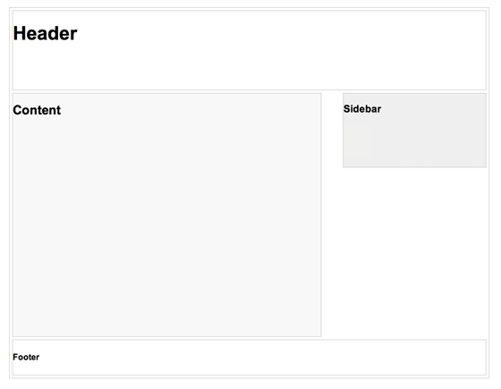
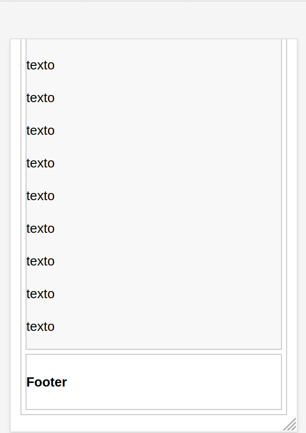

## Enunciat Media Query

Partim del següent codi en `html`

??? note "Codi de l'enunciat"
    ```html
        <!doctype html>
        <html lang="en">
        <head>
        <meta charset="utf-8">

        <!-- viewport meta to reset iPhone inital scale -->
        <meta name="viewport" content="width=device-width, initial-scale=1.0">

        <title>Demo: Crear diseño responsive en 3 pasos - CSSBlog ES</title>

        <!-- css3-mediaqueries.js for IE8 or older -->
        <!--[if lt IE 9]>
            <script src="http://css3-mediaqueries-js.googlecode.com/svn/trunk/css3-mediaqueries.js"></script>
        <![endif]-->

        <style type="text/css">

        body {
            font: 1em/150% Arial, Helvetica, sans-serif;
        }
        a {
            color: #669;
            texto-decoration: none;
        }
        a:hover {
            texto-decoration: underline;
        }
        h1 {
            font: bold 36px/100% Arial, Helvetica, sans-serif;
        }

        /************************************************************************************
        ESTRUCTURA
        *************************************************************************************/
        #pagewrap {
            padding: 5px;
            width: 960px;
            margin: 20px auto;
        }
        #header {
            height: 180px;
        }
        #content {
            width: 600px;
            float: left;
        }
        #sidebar {
            width: 300px;
            float: right;
        }
        #footer {
            clear: both;
        }

        /************************************************************************************
        MEDIA QUERIES
        *************************************************************************************/
        /* para 980px o menos */


        /* para 700px o menos */


        /* para 480px o menos */

        /************************************************************************************
        FIN MEDIA QUERIES
        ************************************************************************************/

        /* borde & guideline (puedes ignorarlo) */
        #content {
            background: #f8f8f8;
        }
        #sidebar {
            background: #f0efef;
        }
        #header, #content, #sidebar {
            margin-bottom: 5px;
        }
        #pagewrap, #header, #content, #sidebar, #footer {
            border: solid 1px #ccc;
        }

        </style>
        </head>

        <body>

        <div id="pagewrap">

            <div id="header">
                <h1>Header</h1>
                Exemple per a la pràctica del tema 3
            </div>

            <div id="content">
                <h2>Contenido</h2>
                <p>texto</p>
                <p>texto</p>
                <p>texto</p>
                <p>texto</p>
                <p>texto</p>
                <p>texto</p>
                <p>texto</p>
                <p>texto</p>
                <p>texto</p>
                <p>texto</p>
            </div>

            <div id="sidebar">
                <h3>Sidebar</h3>
                <p>texto</p>
                <p>texto</p>
            </div>
            
            <div id="footer">
                <h4>Footer</h4>
            </div>

        </div>

        </body>
        </html>
    ```

Aquest codi es visualitza en pantalles grans d'una forma similar a aquesta.



El nostre disseny serà aquest per defecte. 

Per a amplades menors de 980px cal fer els contenidors fluids i que tinguen aquestes amplades.

```css
#pagewrap { width: 94%;}
#content {width: 65%;}
#sidebar {width: 30%;}
```

Per al **viewport** de 700px o menys el #content i #sidebar passa a una amplària acte i s'elimina el `float` així tindrà una amplària completa, al 100%.


Per a 480px o menys reinicialitza el #header a `auto`, canvia la font h1 a 24px i amaga la barra lateral.



### Consells

!!! info

    Pots partir d'un disseny per a dispositius menuts i anar adaptant-lo a grans. O bé fer un disseny per a grans i anar adaptant-lo a dispositius menuts.


En funció de la tècnica que adoptes, caldrà que "juegues" amb els `max` o els `min`. [Ací](https://www.jairogarciarincon.com/clase/introduccion-a-las-aplicaciones-web-con-html5-css3-y-javascript/diseno-responsive-con-media-queries) tens una explicació de les dues tècniques.


## Enunciat efectes CSS

Complementa l'exercici anterior introduint en alguna de les seccions de la pàgina alguns dels punts estudiats en el tema. Exemples...

- Fes els fons en en degradat.
- Inclou una imatge en la que es faça un gir en 3D en passar el ratolí per damunt.