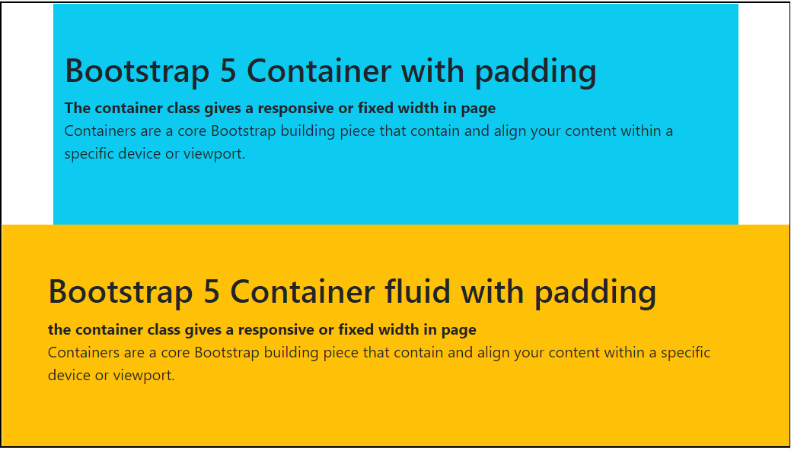

## Que és Bootstrap?

!!! info "Bootstrap"

    Bootstrap és un framework de codi obert i lliure que facilita el desenvolupament ràpid de llocs web i aplicacions mòbils responsives. Va ser creat per Twitter i es basa en HTML, CSS (principalment SCSS) i JavaScript.

Les característiques principals de Bootstrap inclouen:

1. **Sistema de Rejilla Responsiva:** Bootstrap utilitza un sistema de rejilla basat en 12 columnes que facilita la creació de llocs web responsius. Les columnes es poden organitzar i apilar automàticament en funció de la grandària de la pantalla.

2. **Conjunt de Components:** Bootstrap proporciona un conjunt extens de components predefinits com botons, caixes de text, taules, formularis, navegació, pestanyes, entre d'altres. Això permet als desenvolupadors construir pàgines web de manera ràpida sense necessitat de crear tots els elements des de zero.

3. **Tipografia i Estil de Botigues:** Bootstrap inclou estils de tipografia consistent i opcions per personalitzar les fonts i els colors. També ofereix classes de CSS per estils de botigues, alertes, i altres elements d'interfície.

4. **Component Responsius i Mòbils:** Amb Bootstrap, les pàgines es poden desenvolupar de manera que siguin totalment responsives i adaptades a dispositius mòbils. Això es fa fàcil mitjançant l'ús del sistema de rejilla i d'altres components adaptatius.

5. **JavaScript Integrat:** Bootstrap inclou algunes funcionalitats de JavaScript per a components com modals, carousels, collapsibles i altres elements interactivos. També ofereix una versió amb només CSS per als casos en què no es necessiti JavaScript.

6. **Personalització Fàcil:** Els desenvolupadors poden personalitzar Bootstrap mitjançant la pàgina web oficial de Bootstrap, on poden seleccionar els components que volen utilitzar i personalitzar els colors, les fonts i altres estils.

7. **Comunitat Activa:** Bootstrap té una gran comunitat d'usuaris i desenvolupadors que proporcionen suport, recursos addicionals i extensions per a Bootstrap. Això fa que sigui fàcil trobar solucions per a problemes comuns i aprofitar extensions útils.

## Instalar Bootstrap

Per incorporar Bootstrap 5 als teus projectes HTML, pots fer servir CDN o instal·lar Bootstrap mitjançant npm (Node Package Manager). Aquí tens els passos per ambdues opcions:

### Utilitzant CDN:

1. **Afegir Enllaços al teu HTML:**
   Afegix els enllaços següents a l'element `<head>` del teu arxiu HTML:

   ```html
   <!-- Enllaç a Bootstrap CSS -->
   <link rel="stylesheet" href="https://cdn.jsdelivr.net/npm/bootstrap@5.3.0/dist/css/bootstrap.min.css" integrity="sha384-DfXdz2htPH0lsSSs5nCTpuj/zy4C+OGpamoFVy38MVBnE+IbbVYUew+OrCXaRkfj" crossorigin="anonymous">
   ```

   Pots afegir aquest enllaç just abans de la etiqueta de tancament `</head>`.

   **Nota:** A partir de Bootstrap 5, jQuery ja no és una dependència obligatòria, de manera que ja no necessites afegir enllaços per a jQuery i Popper.js.

2. **Utilitzar Classes de Bootstrap 5:**
   A partir d'aquí, pots utilitzar classes de Bootstrap 5 als teus elements HTML. Per exemple:

   ```html
   <div class="container">
     <button class="btn btn-primary">Boto Bootstrap</button>
   </div>
   ```

### Utilitzant npm:

1. **Instal·lar Bootstrap 5:**
   Utilitza la comanda npm per instal·lar Bootstrap 5. Executa aquesta comanda en el directori del teu projecte:

   ```bash
   npm install bootstrap@5
   ```

2. **Afegir Imports al teu Codi:**
   Importa Bootstrap 5 al teu codi JavaScript. Això es pot fer al principi del teu arxiu JavaScript o a través del teu punt d'entrada (per exemple, `main.js`):

   ```javascript
   import 'bootstrap/dist/css/bootstrap.min.css';
   import 'bootstrap/dist/js/bootstrap.bundle.min.js';
   ```

   Assegura't que aquest codi s'executi abans de qualsevol altra part del teu codi que faci servir Bootstrap 5.

Amb aquests passos, hauries de poder utilitzar Bootstrap 5 en el teu projecte HTML. Si necessites més detalls o vols explorar les funcionalitats específiques de Bootstrap 5, pots consultar la documentació oficial de Bootstrap 5: [Bootstrap Documentation](https://getbootstrap.com/docs/5.3/getting-started/introduction/).

## Containers

A Bootstrap, els "containers" són un element clau que s'utilitza per encapsular el contingut de la pàgina. Actuen com a contenidors principals per a la disposició de la pàgina, i ajuden a controlar la mida i la disposició del contingut.

Hi ha dues classes principals de containers a Bootstrap:

1. **Container Fluid (`container-fluid`):**
   - És un contenidor que ocupa tot l'ample de la finestra del navegador.
   - S'expandeix per cobrir tot l'ample de la finestra, i no té cap màxim de mida fixa.
   - És ideal per a llocs web que volen utilitzar l'ample complet de la finestra, especialment en pantalles grans.

   Exemple:

   ```html
   <div class="container-fluid">
     <!-- Contingut de la pàgina -->
   </div>
   ```

2. **Container Fix (`container`):**
   - És un contenidor amb un ample fix.
   - S'ajusta al centre de la pàgina i té un ample màxim en funció de la grandària de la pantalla.
   - És útil per a la majoria dels llocs web, ja que proporciona una àrea centrada i llegible amb una amplada limitada.

   Exemple:

   ```html
   <div class="container">
     <!-- Contingut de la pàgina -->
   </div>
   ```

Els containers es solen utilitzar com a envoltori principal per a contingut com headers, seccions, botons, formularis, i altres elements HTML. Aquesta estructura facilita la creació de dissenys responsius i s'adapta bé a diferents dimensions de pantalla.

És important destacar que els containers no estan limitats a la part superior de la pàgina. Pots tenir diversos containers a la mateixa pàgina per a diferents seccions. Les classes `container` i `container-fluid` proporcionen una base per organitzar i controlar el teu contingut amb Bootstrap.

```html
    <!DOCTYPE html>  
    <html lang="en">  
      <head>  
         <title> Bootstrap 5 container Example </title>  
         <meta charset = "utf-8">  
         <meta name = "viewport" content = "width=device-width, initial-scale=1">  
         <link href = "https://cdn.jsdelivr.net/npm/bootstrap@5.1.3/dist/css/bootstrap.min.css" rel = "stylesheet">  
         <script src = "https://cdn.jsdelivr.net/npm/bootstrap@5.1.3/dist/js/bootstrap.bundle.min.js">  
         </script>  
         <style>  
            body{  
            border:2px solid black;  
            }  
         </style>  
         </head>  
    <body>  
      <div class="container py-5 bg-info">  
         <h1> Bootstrap 5 Container with padding </h1>  
         <b>The container class gives a responsive or fixed width in page </b>  
         <p> Containers are a core Bootstrap building piece that contain and align your content within a specific device or viewport. </p>  
      </div>  
      <div class="container-fluid py-5 px-5 bg-warning">  
         <h1> Bootstrap 5 Container fluid with padding </h1>  
         <b>the container class gives a responsive or fixed width in page </b>  
         <p> Containers are a core Bootstrap building piece that contain and align your content within a specific device or viewport. </p>  
      </div>  
    </body>  
    </html>  
```



Les messures que ocupen els containers són les que es mostren en la taula següent:


